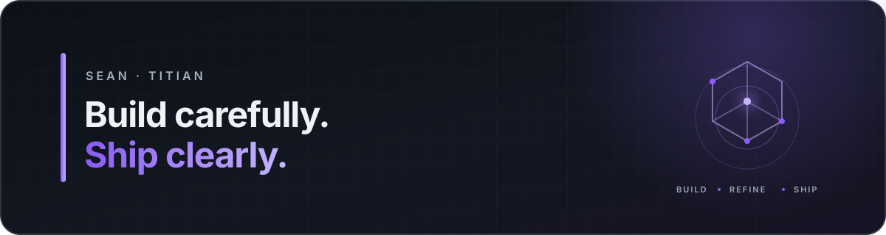

  

  <a href="https://github.com/Sean-Titian?tab=repositories">Projects</a>
  ·
  <a href="https://github.com/Sean-Titian?tab=stars">Learning shelf</a>
  ·
  <a href="https://www.linkedin.com/in/zishen-tian-a14318320/">LinkedIn</a>

## Hello, I'm Sean (Zishen) Tian.

I am building toward **Applied / Product Data Science with strong ML Engineering skills**. I care about the full path from a product question to a trustworthy decision: define the metric, validate the data, model the uncertainty, test the intervention, and ship a reproducible system.

I am pursuing an M.S. in Spatial Economics and Data Analysis at the University of Southern
California (expected 2027), bringing an econometrics lens to product experimentation and applied
machine learning.

### T-shaped direction

| Depth I am developing | Breadth I am building | Long-term direction |
| :--- | :--- | :--- |
| Experimentation · Causal inference · Applied ML | SQL · PySpark · MLOps · Cloud · LLM systems | Applied / Product Data Scientist → Applied Scientist / ML Scientist |

I treat this as a roadmap, not a wall of skill badges. A technology appears as a demonstrated strength only after a project makes the design choices, limitations, and evidence visible.

### Selected work

Each case study is rebuilt from my own analysis and excludes private course material, restricted
data, and unverifiable claims. Projects are linked only after passing a reality, license,
reproducibility, and documentation review.

<!-- PROFILE:PROJECTS:START -->
- **[Conversion Intelligence](https://github.com/Sean-Titian/conversion-intelligence)** — leakage-aware acquisition scoring (AP 0.133 vs. 3.2% prevalence; 5.25× lift at the top 5%) with prediction-time contracts and decision-cost auditing. Under an illustrative 4:1 FN:FP loss ratio, the cost-aware rule reduced modeled loss by 17.3% versus a 0.50 threshold; validation-selected cutoffs showed no material gain over the theoretical 0.20 rule, and the higher-scoring final-session model is explicitly non-deployable.
- **[Lifecycle Email Experimentation](https://github.com/Sean-Titian/lifecycle-email-experimentation)** — reality-audited multi-arm messaging analysis: only 1 of 24 retrospective funding snapshot differences survived correction (+0.311 pp; adjusted p ≈ 0.011), while no cadence winner was supported. The public-safe implementation adds fixed windows, Holm/BH control, a pre-treatment negative control, temporal funnels, guardrail denominators, tests, and CI.
- **Amazon Review NLP** *(in review)* — a private text-classification study using star ratings as a sentiment proxy, currently undergoing a clean-room rebuild; publication is gated on leakage-safe evaluation, data licensing/privacy, and end-to-end reproducibility.
<!-- PROFILE:PROJECTS:END -->

### How I work

| Frame the decision | Separate prediction from causality | Build for review |
| :--- | :--- | :--- |
| Start with the user, metric, prediction time, and cost of error. | Use observational models for ranking; use experiments for intervention claims. | Add data contracts, tests, CI, model cards, and honest limitations. |

### Current build sequence

1. Product conversion modeling, decision-cost audit, and experimentation handoff — **published**
2. Multi-arm lifecycle messaging experimentation — **published**
3. Clean-room NLP reliability evaluation and deployment discipline — **next**
4. SQL/PySpark feature pipelines, MLOps, AWS, and LLM systems as deeper extensions—not decorative add-ons

  Measure carefully · Build responsibly · Improve in public

