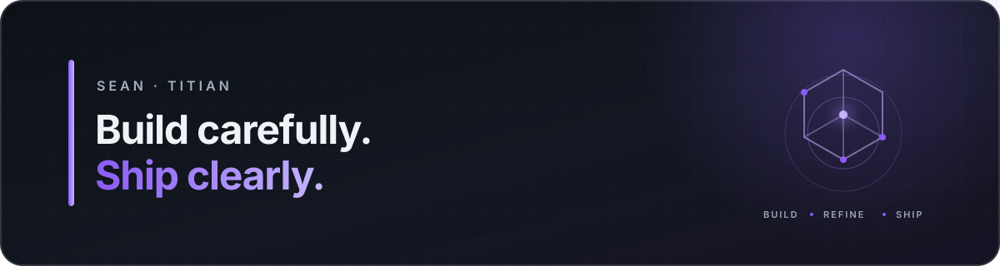

  

  <a href="https://github.com/Sean-Titian?tab=repositories">Projects</a>
  ·
  <a href="https://github.com/Sean-Titian?tab=stars">Learning shelf</a>
  ·
  <a href="https://www.linkedin.com/in/zishen-tian-a14318320/">LinkedIn</a>

## Hello, I'm Sean (Zishen) Tian.

I am building toward **Applied / Product Data Science with strong ML Engineering skills**. I care about the full path from a product question to a trustworthy decision: define the metric, validate the data, model the uncertainty, test the intervention, and ship a reproducible system.

I am pursuing an M.S. in Spatial Economics and Data Analysis at the University of Southern
California (expected 2027), bringing an econometrics lens to product experimentation and applied
machine learning.

### Selected work

Each case study is rebuilt from my own analysis and excludes private course material, restricted
data, and unverifiable claims. Projects are linked only after passing a reality, license,
reproducibility, and documentation review.

<!-- PROFILE:PROJECTS:START -->
- **[Conversion Intelligence](https://github.com/Sean-Titian/conversion-intelligence)** — acquisition scoring with a prediction-time contract: mean AP 0.133 against a 3.2% base rate and 5.25× lift at the top 5%. A synthetic-only Spark SQL/PySpark extension enforces event- and availability-time cutoffs and one row per score request, with exact Spark/Pandas parity on its deterministic fixture. Package 0.2.1 additionally preflights raw CSV headers and embeds one fail-closed feature projector across fit, direct prediction, and in-memory serialization reload; duplicate schemas and invalid known numeric domains are rejected without changing any reported metric or estimator algorithm. The higher-scoring full-session model remains a retrospective upper bound because its final page count is unavailable at the acquisition-time decision.
- **[Lifecycle Email Experimentation](https://github.com/Sean-Titian/lifecycle-email-experimentation)** — a messaging case study that separates a limited retrospective source audit from a public-safe prospective rehearsal. Version 0.2.0 adds six content-by-cadence cells plus a concurrent holdout, stratified block assignment, aligned 14-day intention-to-treat outcomes, multiplicity-aware funding tests, and simultaneous customer-risk bounds. Its canonical synthetic decision is `continue_testing`: evidence that the decision contract runs, not that a campaign works or is safe to launch. In the retrospective source snapshot, only 1 of 24 exploratory funding differences survived correction (+0.311 pp; adjusted p ≈ 0.011); this association is non-causal, and no cadence winner was supported.
- **[Review Sentiment Reliability](https://github.com/Sean-Titian/review-sentiment-reliability)** — a clean-room, synthetic-only reliability study for a rating-derived text proxy. Package 0.6.0 / Contract 5.1 retains the 0.5.1 missing-value correction and adds a target-free, aggregate-only recurrence audit over summary, body, and combined model input; the model, split protocols, existing performance metrics, benchmark values, seeds, and decision contract are unchanged. Across three strict fingerprint-group seeds, normalized-exact and token-set-equality cross-partition recurrence of the combined input is zero across train, validation, and test. Excluding 81 empty bodies, body-only recurrence affects 28.5%–29.7% of non-empty raw rows and 38.0%–42.8% of non-empty test rows; all eight summary templates recur across partitions and affect 100% of rows. These component-field rates document exposure, not target leakage, and the equality-only audit does not validate fuzzy or semantic near-duplicate detection. Across four correlated synthetic windows, mean AP changes versus zero delay are +0.003 and −0.008 at 14 and 30 days, while mean lift-at-10% changes are −0.091 and −0.166; these are descriptive, not confidence intervals or evidence that one delay is preferable. With no observed label-availability timestamp and a rating-derived target that may already be visible, there is no real-data, causal, operational, or production-value claim.
<!-- PROFILE:PROJECTS:END -->

### How I work

| Frame the decision | Separate prediction from causality | Build for review |
| :--- | :--- | :--- |
| Start with the user, metric, prediction time, and cost of error. | Use observational models for ranking; use experiments for intervention claims. | Add data contracts, tests, CI, model cards, and honest limitations. |

### T-shaped direction

| Depth I am developing | Breadth I am building | Long-term direction |
| :--- | :--- | :--- |
| Experimentation · Causal inference · Applied ML | SQL · PySpark · MLOps · Cloud · LLM systems | Applied / Product Data Scientist → Applied Scientist / ML Scientist |

I treat this as a roadmap, not a wall of skill badges. A technology appears as a demonstrated strength only after a project makes the design choices, limitations, and evidence visible.

### Evidence shipped, learning next

SQL/PySpark has moved from roadmap to public project evidence through the Conversion pipeline above and its dedicated Spark parity CI. Package 0.2.1 adds controlled schema/preprocessing consistency checks across ingestion, fit, direct scoring, in-memory reload, and point-in-time output; its release CI passes Python 3.11–3.13 plus Java 17/PySpark parity. The tracked benchmarks and reported metrics are unchanged. Together these demonstrate transformation and model-input contract integrity—not production scale, online freshness, cross-language serving parity, or improved real-world model performance.

Experimentation design and decision engineering have also moved from roadmap to public evidence through Lifecycle Email's executable prospective harness. Its canonical synthetic rehearsal passes eight encoded integrity gates but returns `continue_testing` because corrected funding evidence and simultaneous customer-risk bounds do not support launch. This shows that the workflow can refuse a launch; it does not validate the effect of a real campaign.

Review evaluation reliability has now moved from roadmap to public evidence. Package 0.6.0 keeps the corrected 2,400-row synthetic fixture and adds a fail-closed feature-level recurrence gate; existing model-performance metrics remain unchanged from 0.5.1. Contract 5.1 retains four non-overlapping test horizons across a pre-specified zero-day reference and authored 14- and 30-day proxy-label-delay scenarios, assigns every row to train, validation, embargo, test, or future, and refits using only eligible history. Its 12 window-level and three pooled test-label-alignment placebo gates pass. The new audit uses no target-bearing field and emits aggregates only: normalized-exact and token-set equality induce the same groups on this fixture, with 1,305 non-empty body groups and 1,731 combined-input groups; 199–207 body groups cross partitions, while combined-input cross-partition recurrence is zero. This documents equality-based feature exposure—not proof of target leakage or validation of fuzzy or semantic similarity. Recurring text and entities still cross time, and the fixed delays are not observed label latency. This demonstrates evaluation plumbing that can expose uncertainty—not a validated target, SLA, production benefit, or staffing recommendation.

Next I am replacing synthetic assumptions with evidence: obtain an independently labeled operational target that remains useful when ratings are visible, with an observed outcome window and `label_available_at`; resolve direct provenance and reuse rights; and scale near-duplicate validation with measured false-merge risk. Time-block uncertainty and prior-drift tests follow once that target and its maturity process exist. No real-data performance claim will be promoted until those gates pass.

  Measure carefully · Build responsibly · Improve in public

